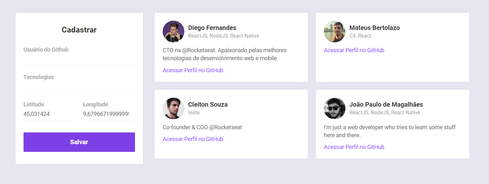
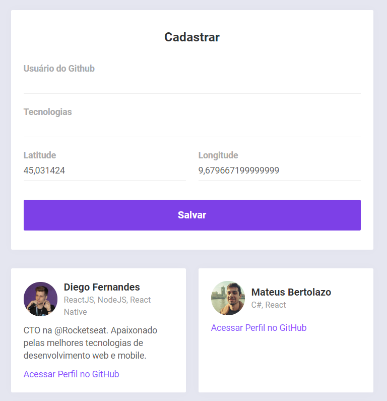
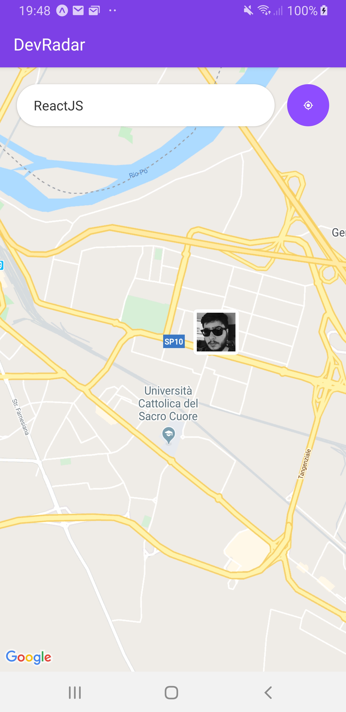
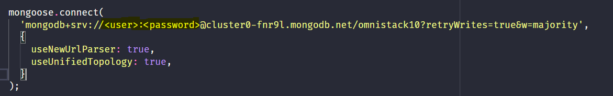
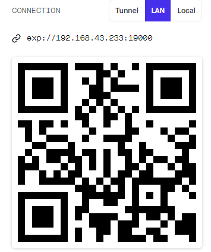

# Dev Radar

Este projeto foi durante a semana omnistack lecionada pela [Rocketseat](https://rocketseat.com.br/). O intuito da aplicação é
de conectar desenvolvedores através de tecnologias de interesse e proximidade.


# Ferramentas Utilizadas

<p>Este projeto foi desenvolvido com o uso das seguintes tecnologias:</p>

- [Node JS](https://nodejs.org/en/)
- [React JS](https://reactjs.org/)
- [React Native](https://facebook.github.io/react-native/)
- [React Navigation](https://reactnavigation.org/)
- [React Native Web View](https://github.com/react-native-community/react-native-webview)
- [Socket io](https://socket.io/)
- [Expo](https://docs.expo.io/versions/latest/)
- [VSCode](https://code.visualstudio.com/)
- [ESlint](https://eslint.org/)
- [Prettier](https://prettier.io/)
...

# Imagens do Projeto

<p align="center">
  
</p>

<p align="center">
  
</p>

<p align="center">
  
</p>

# Rodando localmente

<p>Pra conseguir rodar o projeto, primeiramente você deve ter em sua máquina pelo menos um dos gerenciadores de pacote abaixo: </p>

- [Yarn](https://yarnpkg.com/lang/en/) (recomendado)
- [NPM](https://www.npmjs.com/)


<p>
  O próximo passo é baixar o projeto. Pode ser via zip ou se preferir com o git:
</p>

```
  git clone https://github.com/Mazin97/Omnistack-10.git
```

<p>
  Inicialmente, você precisa instalar todas as dependências de funcionamento do projeto, para isso, com o terminal aberto na pasta do   projeto, execute:
</p>

```
  yarn install
```

### Backend

Pra funcionar 100%, é fundamental colocar suas credenciais de um cluster do [MongoDB](https://www.mongodb.com/cloud/atlas) no arquivo index.js.



<p>
  Para iniciar o backend, com o seu terminal aberto na pasta do projeto, execute o seguinte script: 
</p>

```
  yarn dev
```

### Web

<p>
  Para iniciar a parte web é recomendável que já esteja com o backend rodando. Com o seu terminal aberto na pasta do projeto, 
  execute o seguinte script:
</p>

```
  yarn start
```

### Mobile

<p>Executando o projeto:</p>

<p>
  A aplicação foi desenvolvida através da utilização do Expo, portanto podemos rodar o projeto em nossos próprios aparelhos. Você pode
  baixar na loja de aplicativos do seu sistema operacional.
</p>

- [Expo Ios](https://apps.apple.com/br/app/expo-client/id982107779)
- [Expo Android](https://play.google.com/store/apps/details?id=host.exp.exponent&hl=pt_BR)

<p>
Para inicializar a aplicação, utilize esse script:
</p>

```
  yarn start
```

<p>
  Após iniciar o projeto, o seu navegador irá abrir uma nova aba com um QRCode, você pode escanear esse código ou até mesmo
  no seu terminal que rodou o script anteriormente. Depois disso é só aguardar o expo carregar o aplicativo!
</p>

<p align="center">
  
</p>

</br>

<p>
  Pronto! agora você já pode escolher suas Techs preferidas e conectar-se com desenvolvedores próximos :D
</p>

Obrigado Rocketseat pela oportunidade!
